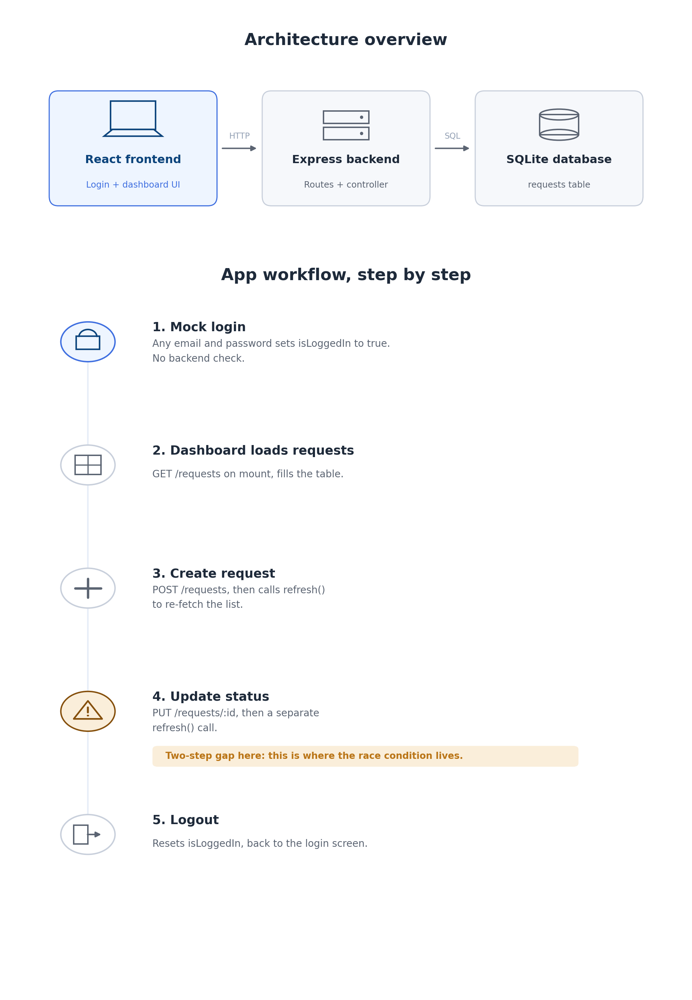

# Client Requests Dashboard

A minimal full-stack internal dashboard for tracking client requests, built as a technical assessment submission.

<p align="center">
  
  
  
  
  
</p>
- **Frontend:** React (Vite)
- **Backend:** Node.js / Express
- **Database:** SQLite

## Project structure

```
.
├── backend/
│   ├── server.js              # Express app entry point
│   ├── database.js            # SQLite connection + schema
│   ├── routes/
│   │   └── requestRoutes.js   # /requests route definitions
│   └── controllers/
│       └── requestController.js  # Request handlers (business logic)
│
└── frontend/
    ├── index.html
    ├── vite.config.js
    └── src/
        ├── main.jsx
        ├── App.jsx             # Top-level auth state (mock login)
        ├── pages/
        │   ├── Login.jsx       # Mock login screen
        │   └── Dashboard.jsx   # Main dashboard page
        ├── components/
        │   ├── CreateRequestForm.jsx
        │   └── RequestsTable.jsx
        └── services/
            └── api.js          # Centralized Axios instance
```

Frontend and backend are fully decoupled, they only communicate over HTTP through the `/requests` REST API, and the frontend's API base URL is environment-configurable (`VITE_API_URL`), so either side can be deployed or swapped independently.

## Workflow diagram



**1.User logs in.**
The login screen doesn't actually check anything against a database, type any email and password, hit "Log In," and the app just flips a switch in memory (`isLoggedIn = true`) and shows you the dashboard. It's a placeholder, not real security.

**2. The dashboard asks the backend for data.**
The moment the dashboard appears, the frontend sends a request to the backend: "give me all the requests." The backend asks the SQLite database for every row in the `requests` table, sends them back as JSON, and the frontend puts them in the table you see.

**3. Adding a request.**
When the fills in the form and hits "Add," the frontend sends that data to the backend, which inserts a new row into the database. Right after that, the frontend asks the backend for the full list *again*, so the table refreshes and shows your new entry.

**4. Updating a status.**
Clicking "Next Status" does two separate things, one after another: first it tells the backend "change this request's status," and the backend updates that row in the database. Then , as a second, separate step , the frontend asks for the whole list again so the table shows the new status.

**5. Logging out.**
Just flips that same switch back (`isLoggedIn = false`), which sends you back to the login screen. Nothing is sent to the backend.

The one thing worth really understanding, steps 3 and 4 are always **two requests, not one** , "do the thing" and then "go fetch everything again to see the result." That gap between the two requests is where timing problems can creep in.

## Setup instructions

### 1. Backend

```bash
cd backend
npm install
npm start
```

Runs on `http://localhost:5000`. On first run it creates `database.db` (SQLite file) and a `requests` table automatically , no manual DB setup needed.

Quick check: open `http://localhost:5000` — you should see `{"message": "Backend is working"}`.

### 2. Frontend

In a separate terminal:

```bash
cd frontend
npm install
npm run dev
```

Open the printed local URL (usually `http://localhost:5173`).

> Start the backend **before** the frontend, since the dashboard fetches requests on load.

## API design

| Method | Endpoint         | Description                          | Body                                          |
|--------|------------------|---------------------------------------|------------------------------------------------|
| GET    | `/requests`      | Fetch all client requests             | —                                              |
| POST   | `/requests`      | Create a new request                  | `{ client, title, description, category }`     |
| PUT    | `/requests/:id`  | Update a request's status             | `{ status }`                                    |

**Data model (`requests` table):**

```
id            INTEGER PRIMARY KEY AUTOINCREMENT
client        TEXT NOT NULL
title         TEXT NOT NULL
description   TEXT
category      TEXT
status        TEXT DEFAULT 'New'
created_at    DATETIME DEFAULT CURRENT_TIMESTAMP
```

Status flows: `New → In Progress → Done`. The "Next Status" button on the dashboard advances a request one step at a time and calls `PUT /requests/:id`.

## Frontend flow

1. `App.jsx` holds a simple `isLoggedIn` boolean and renders `Login` or `Dashboard` accordingly ; this is intentionally a mock, not real auth.
2. `Dashboard.jsx` fetches all requests on mount (`GET /requests`) and passes them down to `RequestsTable`.
3. `CreateRequestForm` posts new requests, then calls `refresh()` to re-fetch the list.
4. `RequestsTable`'s "Next Status" button calls `PUT /requests/:id`, then also calls `refresh()`.

This refetch-after-write pattern is what Task 2 below focuses on, since it's the main source of the described bugs.

## Notes on scope

This is intentionally minimal per the assessment brief: no real authentication, no pagination, no request validation library, and SQLite instead of a production-grade RDBMS. See `TASK2.md` for how this would evolve for production scale.
